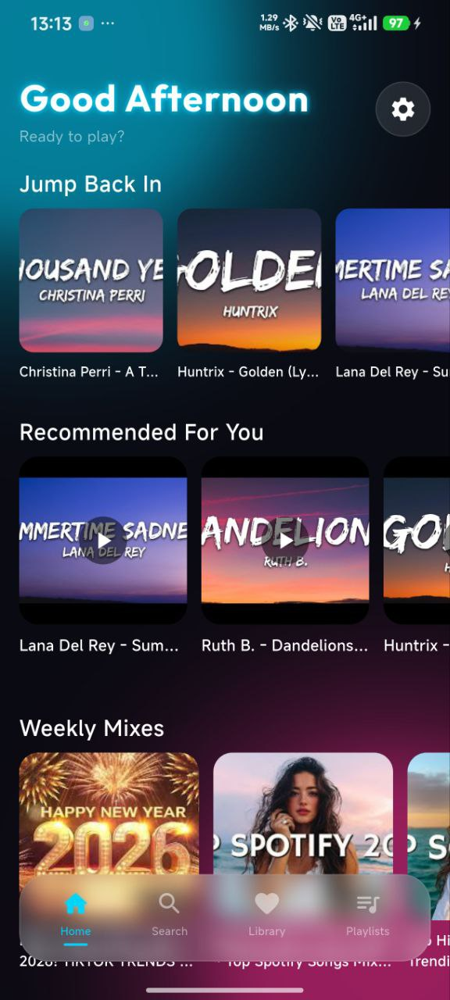
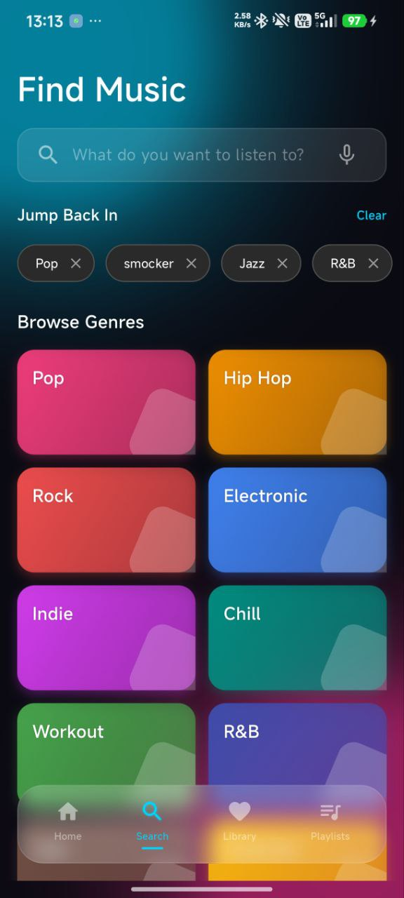
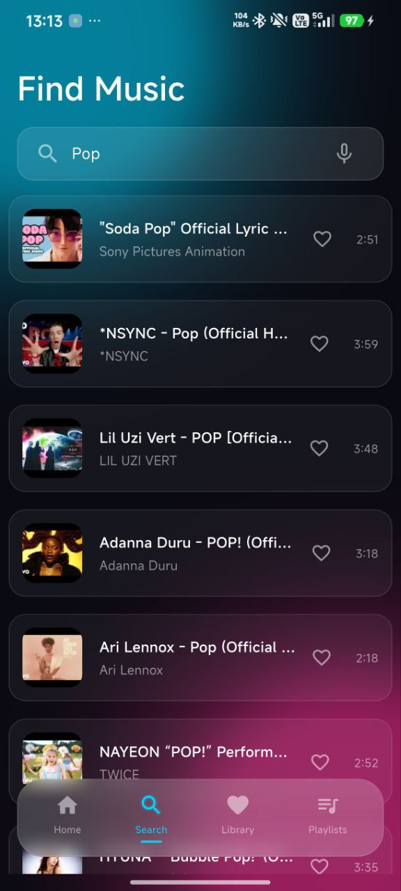
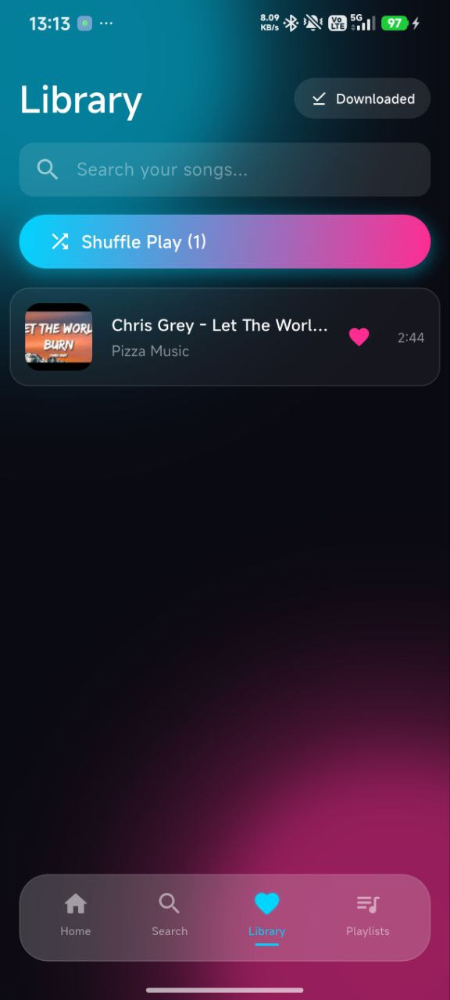
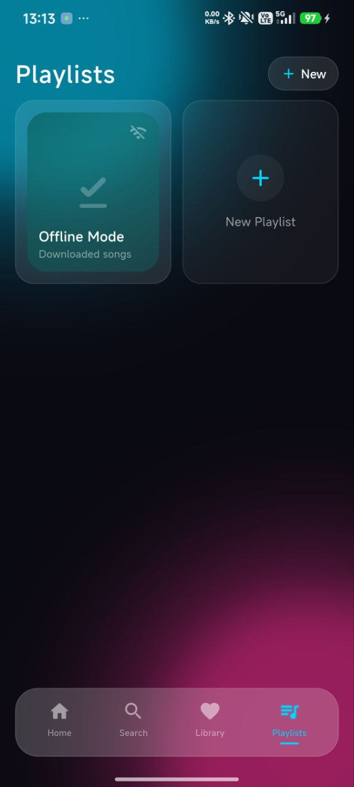
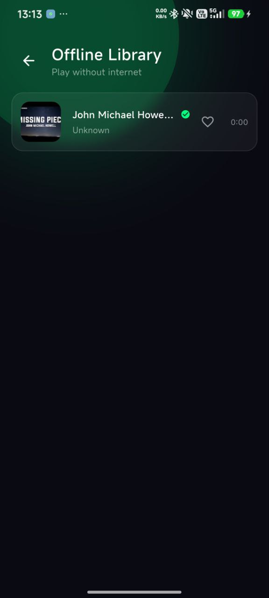
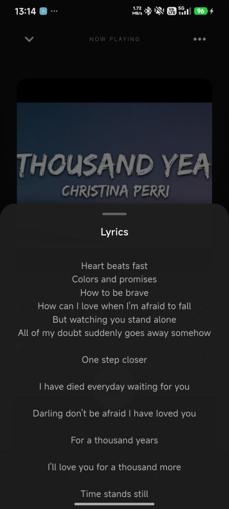

# 🎵 MusiBoom

A powerful, ad-free music player built with Flutter. Stream music directly from YouTube with background playback, real-time lyrics, and offline support.

  
  
  
  
  
  
  
  
  

## ✨ Key Features
* **YouTube Streaming:** Play any song from YouTube audio streams.
* **Background Play:** Keep listening while using other apps or when the screen is off.
* **Real-Time Lyrics:** Automatically fetches lyrics for the current song.
* **Offline Mode:** Download songs to your device for offline listening.
* **Queue Management:** Create playlists, shuffle, and loop.
* **Sleep Timer:** Fall asleep to music without draining your battery.

## 🚀 Download
Get the latest APK from the [Releases Page](https://github.com/symeq/MusiBoom/releases/tag/v1.0.0).

## 🛠️ Built With
* [Flutter](https://flutter.dev/)
* [Just Audio](https://pub.dev/packages/just_audio) (Audio Engine)
* [Youtube Explode](https://pub.dev/packages/youtube_explode_dart) (Streaming)
* [Provider](https://pub.dev/packages/provider) (State Management)